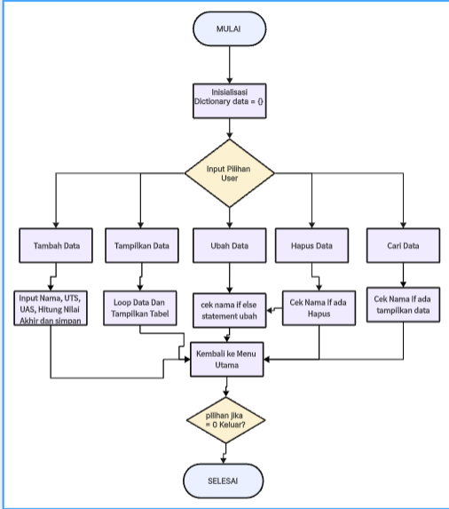
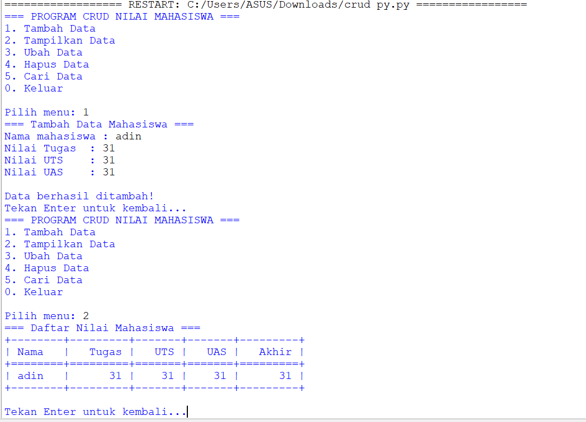

## Tugas Pengantar Pemograman 
Ini adalah tugas dari ikram ramadhan dengan dosen pengampu bapak Agung Nugroho, S.Kom., M.Kom

````shell
Nama   : Ikram Ramadhan
Nim    : 312110478
Matkul : Pengantar Pemograman
````
## code,flowchart dan output program  
````shell
nama = input("Masukkan nama: ")
uts = input("Masukkan nilai UTS: ")
uas = input("Masukkan nilai UAS: ")
tugas = input("Masukkan nilai Tugas: ")

akhir = (int(tugas) * 0.2) + (int(uts) * 0.4) + (int(uas) * 0.4)
keterangan = ("TIDAK LULUS", "LULUS")[akhir > 60.0]

if akhir > 80:
    huruf = "A"
elif akhir > 70:
    huruf = "B"
elif akhir > 50:
    huruf = "C"
elif akhir > 40:
    huruf = "D"
else:
    huruf = "E"

print("\nNama :", nama)
print("Nilai UTS :", uts)
print("Nilai UAS :", uas)
print("Nilai Tugas :", tugas)
print("Nilai Akhir :", akhir)
print("\nNilai Huruf :", huruf)
print("Keterangan :", keterangan)
````
 *Flowchart program:*
  
  * *
  * *Hasil output program:*
    
    * *